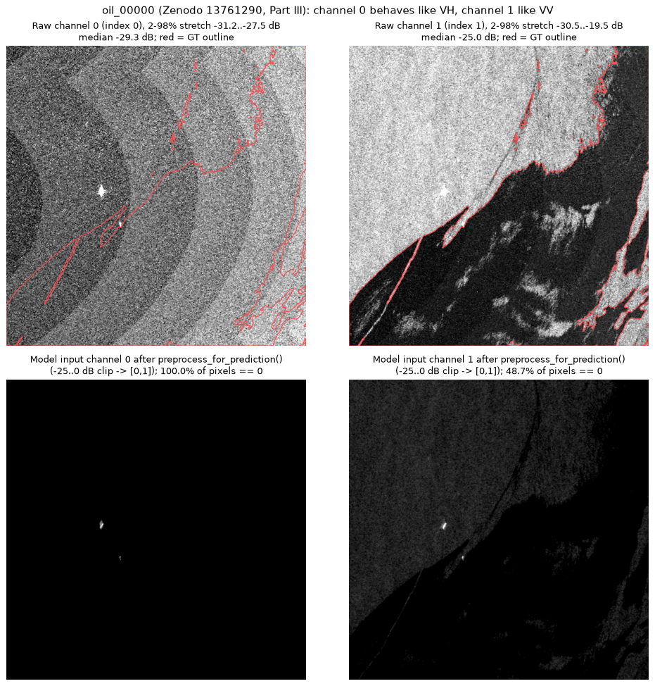

# SAR Channel-Order Investigation (2026-09-27)

**Status (updated 2026-09-27, same day): fix applied.** The investigation
below was done first, read-only. The §5 fix was then approved and applied:
- evalscript swapped;
- live VV preview reads index 1;
- two regression tests.

In addition:
- The evaluator figure label was corrected (§6).
- Pre-fix live records were marked rather than deleted (§4a).
- The `no_oil_00005` cause was traced (§7.5).

Checkpoints and preprocessing are unchanged. Supporting files:
- `docs/channel_order_oil_00000.png`;
- `docs/channel_order_investigation.json` (raw numbers);
- `scripts/channel_order_investigation.py`, a read-only script that
  reproduces every number below.

## TL;DR

1. **The Trujillo-Acatitla GeoTIFFs are stored as index 0 = VH, index 1 =
   VV**, the reverse of the `(VV, VH)` the repo assumes everywhere. No
   dataset-author statement of the band order was found (§1). The conclusion
   rests on three independent lines of evidence that agree:
   - physics on the pixels: slick contrast is in index 1 in 10/10 oil
     scenes, and index 0 < index 1 in 27/29 valid scenes, opposite in sign
     to the known-order live CDSE scenes (§2);
   - the trained checkpoints work best in the stored layout (§3);
   - a third-party audit that read SNAP's embedded band names in the Part I
     files (§1c).
2. **The live path is mismatched.** `src/data/cdse_fetch.py` writes
   `[VV, VH]`, so live scenes reach the U-Net with channels swapped relative
   to training. On the three live scenes on disk, the model flags **14.8 %,
   38.0 % and 21.2 %** of the scene as oil as fetched, versus **0.3 %,
   1.0 % and 1.4 %** with the training layout (before land masking; no
   ground truth exists for these). `/api/predict` on holdout scenes is *not*
   affected.
3. **Fix (§5, applied 2026-09-27):** swap the two bands in the Sentinel Hub
   evalscript and move the live VV preview from index 0 to index 1, with two
   regression tests. No retraining, and no checkpoint or preprocessing
   change.
4. **`src/evaluate_holdout.py`'s "SAR VV Channel" panel showed normalized
   VH.** After the −25..0 dB clip it was ~100 % black over sea. It's now
   fixed and the 14 figures are regenerated; the deck copies are untouched
   (§6).

---

## 1. Authoritative band order: what the sources say

Classification used below: **(a)** explicit statement of band order by the
dataset authors; **(b)** the authors list both polarizations but don't say
which band is which; **(c)** third-party claim.

### 1a. Metadata inside the local TIFFs: nothing

`tifffile` tag dump of `data/holdout/images/*.tif` (Part III): no
`GDAL_METADATA` (42112), no `ImageDescription` (270), no `Software` (305),
no SNAP/BEAM-DIMAP tag (65000). Only georeferencing tags are present
(`ModelPixelScale`, `ModelTiepoint`, `GeoKeyDirectory`, WGS 84), with
2 samples/pixel, contiguous, little-endian, uncompressed. The local Part I/II
**masks** (`data/raw/Mask_*`, SCIFIO-written) carry no DIMAP tag either.
Part I/II **images** aren't on disk (Part I images alone are a 40.7 GB
archive).

### 1b. Dataset authors: no band-order statement → (b)

- **Zenodo 8346860 / 8253899 / 13761290** (API `metadata.description` and
  `metadata.notes`, fetched 2026-09-27): all three give the images as
  "2048x2048x2" sigma0 in dB. The notes field says the images have
  "two polarizations (VV, VH)". That's a list of contents, not a stacking
  order. All three records link the same paper via `related_identifiers`.
- **Paper:** Trujillo-Acatitla, Tuxpan-Vargas, Ovando-Vázquez,
  Monterrubio-Martínez, *Marine oil spill detection and segmentation in SAR
  data with two steps Deep Learning framework*, Marine Pollution Bulletin
  204:116549 (2024), doi:10.1016/j.marpolbul.2024.116549. It's paywalled,
  so the full Methods section couldn't be read. Accessible snippets mention
  sub-images "for both polarizations (VV, VH)" → (b).
- **Supplementary material** (free, `1-s2.0-S0025326X24005265-mmc1.docx` on
  ars.els-cdn.com; captions extracted from `word/document.xml` 2026-09-27):
  - The Fig. S2 caption covers preprocessing "from the download to their
    storage as Sigma0 in db". The chain itself exists only as a figure
    image; per the research subagent it's an SNAP chain with thermal-noise
    removal and no explicit band-merge step (not independently checked).
  - Fig. S5: "The model's input consists of two polarizations, VV and VH."
  - Fig. S7: "two channels (VV, VH)".
  - **S7 is the closest thing to an author statement, and it lists VV
    first.** It describes the authors' own CNN input in a caption, uses the
    same "(VV, VH)" wording as the Zenodo notes, and never mentions band
    indices, so it's classed (b). It is nevertheless in tension with
    everything measured below. We weight the measurements, and the
    producer-embedded band names in §1c, above a caption's word order.

### 1c. Third party: SNAP band names in Part I → (c), strongest available

- **AnujAga2005/OilSpill `DATA_AUDIT.md`** (GitHub; fetched and checked
  2026-09-27) reports that band order in all 1,200 Part I oil images "is
  taken from the `BAND_NAME` elements of the BEAM-DIMAP document that SNAP
  embeds in TIFF tag 65000". The order given is `Sigma0_VH_db`,
  `Sigma0_VV_db`, i.e. **index 0 = VH**.
  - Its reported per-band means (VH −34.8 dB, VV −21.0 dB) match the levels
    of our index 0 / index 1.
  - It also reports Part I as big-endian, LZW-compressed. Our Part III copies
    are little-endian, uncompressed and have no tag 65000, so the parts were
    not exported identically. That's why §3 checks that training and holdout
    share a layout rather than assuming it.
- **Halyjo/slicksmith-ttom** (`src/slicksmith_ttom/vis.py`) also treats
  `x[:, 0]` as VH and `x[:, 1]` as VV, but gives no source → (c), weak.

**Verdict:** no primary-source statement exists that we could access. The
producer-embedded band names reported in (c) agree with the physics (§2) and
the model behaviour (§3). Decisive primary confirmation would be to read tag
65000 from one original Part I image. That needs the 40.7 GB
`01_Train_Val_Oil_Spill_images.7z` from Zenodo 8346860 (not downloaded; needs
approval) or the Kaggle copy used for training.

> **Unverified lead with wider impact:** the same third-party audit reports
> that the embedded DIMAP metadata in Part I contains source product IDs and
> acquisition times (2015-03-12 to 2019-10-30, Sentinel-1A/1B).
> `AGENTS.md` / `docs/status.md` state that "this dataset has no acquisition
> timestamps anywhere", which was checked against the Zenodo deposits, not
> the TIFF-internal metadata. If the audit is right, ERA5 / revisit evidence
> could be applied to training scenes. This could not be checked locally,
> because the Part III copies and the Part I/II masks carry no tag 65000.

---

## 2. Physical evidence from the pixels (holdout, Part III)

**Method** (`scripts/channel_order_investigation.py`, stats mode). Raw
GeoTIFF values, which are already sigma0 in dB, with no preprocessing. No-data
pixels (exactly 0 in both bands) are excluded. *Inside* = GT mask eroded with a
41×41 square. *Ring* = GT dilated with an 81×81 square, minus GT. Contrast =
median(inside) − median(ring). Every one of the 10 oil scenes in
`data/holdout` was used (the holdout has exactly 10). Training images for
Parts I/II are not on disk locally (only their masks are); §3 covers them
indirectly.

### 2a. Slick contrast per channel, 10 oil scenes

| scene | ch0 median dB | ch0 contrast dB | ch0 % < −25 dB | ch1 median dB | ch1 contrast dB | ch1 % < −25 dB | median(ch0 − ch1) dB |
|---|---|---|---|---|---|---|---|
| oil_00000 | −29.3 | −0.18 | 99.9 | −25.0 | **−5.96** | 49.9 | −3.98 |
| oil_00001 | −27.9 | −1.87 | 97.0 | −19.5 | **−8.41** | 2.4 | −8.15 |
| oil_00002 | −28.4 | +0.03 | 99.9 | −17.0 | **−6.91** | 6.0 | −11.35 |
| oil_00003 | −27.9 | +0.01 | 99.8 | −19.7 | **−6.99** | 10.6 | −8.16 |
| oil_00004 | −30.4 | −0.16 | 100.0 | −24.4 | **−6.33** | 45.8 | −5.96 |
| oil_00005 | −29.8 | −0.37 | 100.0 | −28.7 | **−6.24** | 62.1 | −1.57 |
| oil_00006 | −29.5 | +0.02 | 100.0 | −24.6 | **−6.41** | 48.0 | −4.59 |
| oil_00007 | −29.9 | −0.13 | 99.9 | −21.7 | **−7.09** | 6.7 | −8.19 |
| oil_00008 | −27.6 | +0.14 | 99.7 | −20.4 | **−5.79** | 13.4 | −7.22 |
| oil_00009 | −31.6 | +0.15 | 100.0 | −21.7 | **−7.09** | 5.3 | −9.82 |
| **median** | | **−0.06** | **99.9** | | **−6.66** | **12.0** | |

- **The slick is visible in ch1 in 10/10 scenes** (contrast −5.8 to −8.4 dB)
  and **essentially invisible in ch0** (−1.9 to +0.15 dB; within ±0.4 dB in
  9/10). Oil dampens Bragg waves, and that damping is strongest and best
  resolved in co-pol VV. Cross-pol VH over sea usually sits at or near the
  sensor noise floor, where damping can't lower it further. This is the
  signature of ch1 = VV and ch0 = VH.
- **Ch0 sits at the Sentinel-1 IW noise floor** (scene medians −27.6 to
  −31.6 dB) and shows the concentric noise-floor banding pattern (figure
  below). Ch1 has the dynamic range expected of VV sea clutter.



*Top: raw dB, 2–98 % stretch, GT outline in red. Bottom: what the model
receives after `preprocess_for_prediction()` (−25..0 dB clip → [0, 1]).
Ch0 is banding only, with no slick, and is ~100 % zeros after the clip; only
two ship returns survive. Ch1 shows the slick exactly along the GT outline.*

### 2b. Co-pol vs cross-pol level, all 29 valid holdout scenes

Over the ocean σ⁰_VV > σ⁰_VH essentially always: the VH/VV ratio is
typically around −6 to −15 dB, approaching 0 dB only when both bands sit
at the noise floor. So the channel with the higher level is VV.

- **Holdout: median(ch0 − ch1) < 0 in 27 of 29 valid scenes** (median
  −6.1 dB). The two exceptions (`lookalike_00000` +1.5 dB,
  `lookalike_00009` +1.1 dB) have *both* channels at the noise floor
  (−25.8 to −27.8 dB, i.e. a very low-wind scene) with 31–49 % no-data,
  where the ratio carries no information. Land-heavy no_oil scenes
  (`no_oil_00004`, `_00006`–`_00009`) have ch0 ≈ −15 to −19 dB and
  ch1 ≈ −8 to −11 dB, which is again ch1 > ch0 by ~7 dB. In
  `no_oil_00006`–`_00008` the brightest targets (ships/land) reach +14.2 to
  +19.4 dB in ch1 but only +1.4 to +6.6 dB in ch0, the co-pol > cross-pol
  pattern expected for strong scatterers.
- **Reference with known order: the 3 unique live CDSE scenes** in
  `data/raw/live/` (12 files, deduplicated by pixel hash). The evalscript in
  `src/data/cdse_fetch.py` writes `[VV, VH]`, so ch0 is VV *by construction*.
  There, **median(ch0 − ch1) = +9.4, +7.2, +7.0 dB**, the opposite sign to
  every informative holdout scene. The live VH medians (−29.1, −18.5,
  −17.7 dB) sit in the same range as holdout ch0; the live VV medians
  (−19.6, −12.2, −11.3 dB) sit in the range of holdout ch1.
- `no_oil_00005` is entirely zeros in both bands: an empty scene shipped in
  the dataset. It doesn't affect this analysis and is excluded above.

### 2c. The fixed −25..0 dB window discards ch0

`preprocess.normalize_image()` clips both channels to −25..0 dB. Share of
pixels below −25 dB (medians per category): **ch0 99.9 % (oil), 98.5 %
(lookalike), 1.0 % (no_oil, where 5 of 9 valid scenes are land-heavy)**;
ch1 12.0 %, 68.4 %, 0.0 %. For
sea scenes, model-input ch0 is therefore ≈ constant 0. During training the
U-Net effectively saw a single informative channel, **ch1 (VV)**, plus a
near-blank ch0.

---

## 3. Which order does the trained checkpoint expect? (inference-only ablation)

Part I/II training images aren't on disk, so their layout can't be measured
directly. What *can* be tested is which layout the checkpoints trained on
them expect. If Parts I/II were `[VV, VH]` while Part III is `[VH, VV]`, the
checkpoints should do *better* on holdout scenes after swapping.

**Method** (`--ablation`). Run `model_real_v2_best.pt` (default) and
`model_real_best.pt` (v1) on each holdout scene twice:

- **as stored**;
- **swapped** (`img[..., ::-1]` before `preprocess_for_prediction()`).

Tiling, threshold and metrics are identical to `src/evaluate_holdout.py`.
Checkpoints are loaded read-only, and nothing is retrained. The as-stored
run **reproduces `docs/holdout_per_scene_results.json` pixel-for-pixel**
for 29/30 v2 scenes and 10/10 v1 oil scenes. The one exception is
`no_oil_00005`; see §7.

| oil scene | v2 IoU as stored | v2 IoU swapped | v1 IoU as stored | v1 IoU swapped |
|---|---|---|---|---|
| oil_00000 | 0.955 | 0.886 | 0.954 | 0.951 |
| oil_00001 | 0.725 | **0.084** | 0.727 | **0.022** |
| oil_00002 | 0.259 | **0.000** (81 % of scene flagged) | 0.253 | **0.009** (85 % flagged) |
| oil_00003 | 0.818 | 0.713 | 0.830 | **0.218** |
| oil_00004 | 0.817 | 0.725 | 0.853 | 0.886 |
| oil_00005 | 0.964 | 0.934 | 0.966 | 0.968 |
| oil_00006 | 0.950 | 0.867 | 0.950 | 0.942 |
| oil_00007 | 0.874 | 0.704 | 0.853 | 0.821 |
| oil_00008 | 0.173 | 0.139 | 0.167 | 0.075 |
| oil_00009 | 0.704 | **0.286** | 0.710 | 0.704 |
| **mean IoU** | **0.724** | **0.534** | **0.726** | **0.559** |
| mean Dice | 0.804 | 0.618 | 0.804 | 0.615 |

- **v2: as stored beats swapped on 10/10 oil scenes.** v1 does on 8/10; the
  two exceptions (oil_00004, oil_00005) differ by 0.033 and 0.003.
- **v2 no-oil scenes:** clean (zero predicted pixels) **6/10 as stored vs
  1/10 swapped**. `no_oil_00001` swapped: **100.0 % of the scene flagged as
  oil** (≈ 0 % as stored).
- v2 lookalike scenes: 0/10 clean either way; mean false-positive area
  37.5 % → 33.4 %. That's uninformative, since this bucket already fails
  (see `docs/status.md`).

**How the swapped regime fails.** With VH in index 1, the −25..0 dB clip
blanks the channel the network relies on (index 1 is ≥ 98.9 % zeros in 9 of
the 10 swapped oil runs; oil_00009, which is half no-data, is 48.6 %). The output then becomes erratic rather than uniformly
bad:

- On scenes with a very dark slick against bright sea it still recovers
  most of the slick: oil_00000/05/06 keep IoU 0.87–0.93 with precision
  ≈ 1.0.
- Elsewhere it misses slicks (oil_00001, oil_00009) or floods the scene
  (oil_00002 81 %, no_oil_00001 100 %, even though index 0 carries
  unclipped VV there).

That scene-dependence may be why the live mismatch went unnoticed: on
dark-slick scenes, swapped-input masks still look plausible.

**Conclusion.** The checkpoints expect the Part III layout, so Parts I/II
(training) and Part III (holdout) share one layout. Combined with §2, the
training layout is **index 0 = VH, index 1 = VV**.

---

## 4. Does the live path match the training order? **No.**

Data flow for `POST /api/live/fetch`:

1. `src/data/cdse_fetch.py:121`: the evalscript returns
   `default: [samples[0].VV, samples[0].VH]` → the on-disk live GeoTIFF has
   **index 0 = VV, index 1 = VH** (linear sigma0).
2. `src/api/main.py:473-474` (`_analyze_live_scene`): `tifffile.imread` →
   `preprocess_for_prediction(image_raw, already_calibrated=True)`. There's no
   channel reordering anywhere in this chain, and none in
   `preprocess_for_prediction` / `run_tiled_inference`.
3. The model therefore receives **[VV, VH]**, while it was trained on
   Trujillo-Acatitla GeoTIFFs laid out as **[VH, VV]** (§2, §3).

The live input is thus exactly the "swapped" condition from §3: the channel the
network relies on (index 1) gets VH, which after the −25..0 dB clip is largely
zeros over open sea. The channel it learned to treat as a near-constant 0
(index 0) gets VV. It's worse than the holdout swap: in the live
GeoTIFFs **7–31 % of VH pixels are exactly 0** (noise-floor clamping; only
0.1–0.2 % of VV pixels are), and those hard zeros land in index 1.

**Measured on the three unique live scenes on disk** (v2, before land
masking; no ground truth, so this shows *how much* the output depends on
the order, not which output is right):

| live scene | index 1 zero after clip, as fetched | flagged as oil, as fetched `[VV, VH]` | flagged as oil, training layout `[VH, VV]` |
|---|---|---|---|
| live_1732117d409d | 75.3 % | **14.8 %** | 0.34 % |
| live_6b42738314d5 | 40.8 % | **38.0 %** | 0.98 % |
| live_df975326df77 | 17.5 % | **21.2 %** | 1.37 % |

`_temporal_evidence` reuses `_analyze_live_scene`, so the revisit comparison
is affected the same way. The cached-scene endpoint `/api/predict` is
**not** affected for holdout scenes, because it reads Part III files that
share the training layout.

**Consequence for existing records.** The evalscript has returned VV first
ever since `cdse_fetch.py` was added (`git log`: `e4c3c1f` used
`return [sample.VV, sample.VH]`; `ac8c318` kept the order). So every live
inference so far used swapped input. That covers:

- the one live detection currently in the main checkout's
  `data/pelagic.db` (#43, `live_1732117d409d`);
- the earlier verification runs cited in `AGENTS.md` / `docs/status.md`
  (#31, #32, #36).

Their *transport/credential* verification stands. Their *segmentation
output* (mask, confidence, polygon area) isn't a valid prediction of the
trained model and would change after the fix.

The live **preview** (`src/api/main.py:496`, `image_raw[:, :, 0]` labelled
"VV sigma0") was *correct* before the fix, because live index 0 really was VV.
It has been moved to index 1 in lockstep with the fetch-time swap (§5).

### 4a. Pre-fix live records (kept, marked)

- **Detection #43** (`live_1732117d409d`, Singapore Strait, 2026-08-10
  acquisition) in `data/pelagic.db` is kept and marked in two places:
  - `supplementary.original.channel_order` records
    `swapped_relative_to_training: true` and lists which fields are
    affected (mask, confidence, predicted pixel count, overlay preview).
  - `supplementary.original.preview_note` has a sentence appended, so the
    caveat shows in the dashboard's observation panel.
  - Its ERA5 wind evidence (4.76 m/s at 11:00 UTC) is independent of the
    SAR bands and remains valid. Its SAR preview was built from the VV band
    and is also correct.
- **Old-layout live GeoTIFFs** (`[VV, VH]`, index 0 = VV) are kept in the main
  checkout's ignored `data/raw/live/`. All 12 predate the fix:

  | file | written |
  |---|---|
  | `live_394b21a89bdd.tif`, `live_b5d4572f47c4.tif` | 2026-09-12 18:53–18:55 |
  | `live_df975326df77.tif`, `live_e720a4bd7525.tif`, `live_c2b2b9d7b579.tif`, `live_d61fbe12ce91.tif` | 2026-09-12 20:20–20:43 |
  | `live_1732117d409d.tif` | 2026-09-14 21:51 (Detection #43) |
  | `live_20aea65b2b18.tif`, `live_bffe3ca081a7.tif`, `live_7237a7a9c8eb.tif`, `live_6b42738314d5.tif`, `live_ee79a5be5a40.tif` | 2026-09-27 00:02–00:16 |

  Any live GeoTIFF written after the fix is `[VH, VV]`. A quick check is that
  over sea, median dB of index 0 < index 1 means the new layout.

---

## 5. Minimal fix (approved and applied 2026-09-27)

Applied as below. The preview test (`tests/test_live_evidence.py::
test_live_sar_preview_uses_vv_band_index_1`) was added beyond the proposal and
confirmed to fail if the preview is reverted to index 0.

**Post-fix live verification.** Re-run through the dashboard with the
screenshot scripts (DB backed up and restored):

| Region | Raw predicted oil px | Removed by land mask | GFW |
|---|---|---|---|
| Singapore Strait | 14,327 (0.34 %, as §4's ablation predicted for this product) | 8.1 % | 5 vessels |
| Stockholm | 41,272 | 27.5 % (453 px via OSM island refinement) | 5 vessels |
| Chonos | 57,628 | 36.9 % | honest none |

The new Singapore GeoTIFF has index 0 median −29.1 dB (VH) and index 1
−19.6 dB (VV), the reverse of the pre-fix file for the same product.

Swap at fetch time so every GeoTIFF the model ever reads (holdout, training,
live) shares one layout: **index 0 = VH, index 1 = VV**. No retraining, and no
change to preprocessing or checkpoints.

```diff
--- a/src/data/cdse_fetch.py
+++ b/src/data/cdse_fetch.py
@@ def fetch_scene_geotiff(...)
 function evaluatePixel(samples) {
   if (!samples.length) return {default: [0, 0], validity: [0]};
-  return {default: [samples[0].VV, samples[0].VH], validity: [samples[0].dataMask]};
+  // Band order matches the Trujillo-Acatitla training GeoTIFFs the checkpoints
+  // were trained on: index 0 = VH, index 1 = VV (docs/CHANNEL_ORDER_INVESTIGATION.md).
+  return {default: [samples[0].VH, samples[0].VV], validity: [samples[0].dataMask]};
 }
@@
-            raise ValueError('Invalid calibrated VV/VH raster')
+            raise ValueError('Invalid calibrated VH/VV raster')
```

```diff
--- a/src/api/main.py
+++ b/src/api/main.py
@@ def _analyze_live_scene(...)
-    # Fixed VV dB display stretch makes different passes visually comparable.
-    vv_db = 10 * np.log10(np.maximum(image_raw[:, :, 0], 1e-10))
+    # Fixed VV dB display stretch makes different passes visually comparable.
+    # Live GeoTIFFs use the training layout (index 0 = VH, index 1 = VV).
+    vv_db = 10 * np.log10(np.maximum(image_raw[:, :, 1], 1e-10))
```

Regression test (extends the existing `tests/test_observations.py::
test_fetch_validates_pixels_and_interval` stub; one added assertion inside
its `process(token, body)`):

```python
assert 'default: [samples[0].VH, samples[0].VV]' in body['evalscript']
```

Why fetch-time rather than a `[..., ::-1]` inside `_analyze_live_scene`: it
keeps one on-disk convention, so the next reader of a live GeoTIFF (preview,
future lookalike filter on live scenes, notebooks) can't repeat the mistake.
Caveats to decide on alongside the fix:

- Live GeoTIFFs already in `data/raw/live/` stay in the old `[VV, VH]` layout.
  Nothing re-reads them today (temporal evidence fetches fresh), but they
  should be deleted or noted as old-layout.
- Past live detections in `data/pelagic.db` keep their swapped-input
  predictions. Re-run or annotate them; don't silently mix them with
  post-fix results.
- The fix corrects the *order*. It doesn't make live scenes identical in
  distribution to training: calibration, noise removal and resampling
  (Sentinel Hub `SIGMA0_ELLIPSOID` vs. the dataset's own SNAP chain) weren't
  compared here.

---

## 6. Misleading labels in the repo

| where | what it says | what it actually is |
|---|---|---|
| `src/evaluate_holdout.py:119-120` | plots `norm[..., 0]` titled **"SAR VV Channel"** | normalized **VH**, ~100 % zeros over sea after the −25..0 dB clip |
| `docs/holdout_v{1,2}_viz_*.png` (14 committed figures) + `README.md:209` ("SAR VV, Ground Truth, Prediction") | left panel "SAR VV Channel" | same as above: the left panel of e.g. `holdout_v2_viz_oil_00000.png` is solid black except two ship returns |
| `docs/deck_assets/MANIFEST.md:33-37` | lists 5 of these figures as deck visuals, `oil_00000` as "Best correct detection example" | the SAR panel shows no slick; should show index 1 (VV), or both channels |
| `src/data/dataset.py:23,138`; `src/models/unet.py:6`; `src/api/main.py:276`; `src/data/verify_real_pipeline.py:50` | "(VV, VH)" | real data is (VH, VV). The synthetic generator (`src/data/generate_synthetic.py`) really does write (VV, VH), so those labels are only right for synthetic scenes |
| `scripts/lookalike_feature_separability_check.py:83,109` | `vv_db = image_raw[..., 0]`, "raw VV/VH dB scene" | index 0 = **VH** |
| `src/analysis/cloud_removal_fusion.py:59,67` | `[VV, VH]` convention, "matches this project's own SAR convention" | would need reversing if DSen2-CR fusion is ever revived (it's currently stopped) |

**Evaluator figure, fixed 2026-09-27.**
- `src/evaluate_holdout.py` now plots **raw VV dB from channel 1** with a
  2–98 percentile stretch over valid pixels. The dB range is printed in the
  title, e.g. "SAR VV (channel 1), −31 to −20 dB – oil_00000".
- All 14 `docs/holdout_v{1,2}_viz_*.png` were regenerated; image size is
  unchanged (2187×766).
- `README.md:209` was updated.
- **The five copies in `docs/deck_assets/` were deliberately not touched.**
  They still show the old near-black panel. Re-copy them from `docs/` if the
  deck should use the corrected figures.
- The other "(VV, VH)" docstrings in the table above are unchanged. The trap
  is documented in `AGENTS.md`.

---

## 7. Related observations (not fixed; for follow-up decisions)

1. **The post-hoc lookalike classifier's texture features were computed on
   VH.** `src/analysis/lookalike_filter.py:96`,
   `kaggle_kernel_lookalike/train_lookalike_classifier.py:348` and
   `scripts/lookalike_feature_separability_check.py:109` all take
   `image_raw[..., 0]` for GLCM/edge features. That's consistent between
   training and inference (no mismatch), but it's the noise-floor channel
   where §2a shows ~0 dB slick contrast. That may contribute to the texture
   features separating oil from lookalikes poorly (untested; recomputing
   them on index 1 would be the check).
2. **The ESSD rejection has a polarization confound.** ESSD patches are
   VV-only (`scripts/essd_feature_extraction.py:8`), while the own-domain
   features they were compared against came from index 0 = VH.
   `docs/status.md` attributes the non-transfer to the JPG domain; the
   comparison also crossed polarizations. This doesn't by itself show ESSD
   would transfer, but the rejection's stated reason is incomplete.
3. **The −25..0 dB clip is VV-appropriate only.** VH needs a lower floor
   (DSen2-CR uses −32.5 dB for VH, already noted in
   `src/analysis/cloud_removal_fusion.py:170-171`). Fixing this changes
   training inputs and so requires retraining: out of scope here.
4. **Synthetic scenes are in the opposite order.** `generate_synthetic.py`
   writes `[VV, VH]`, and `/api/predict` runs the real v2 checkpoint on
   synthetic scenes too, so synthetic demo predictions also get swapped input.
   Low stakes (synthetic), but worth aligning when the live fix lands.
5. **`no_oil_00005` no longer reproduces.** This scene is all zeros in both
   bands. With current code, v2 yields a **100 % false-positive mask** on it
   (an all-zero input reads as scene-wide slick). The 2026-09-27 figure
   regeneration ran `evaluate_holdout.py` for both checkpoints, and both
   report no_oil 6/10 correct versus 7/10 committed. `no_oil_00005` is in both
   committed "correct" lists. The committed `docs/holdout_per_scene_results.json` records it
   as 0 px predicted / "correct" for both checkpoints, so the committed v2
   no_oil numbers, and a fresh (uncached) `/api/predict` run on this
   scene, disagree by one scene.

   **Cause (traced 2026-09-27, read-only; not fixed).** It's the all-zero
   edge case of the dB/linear test, not a model or data change.
   - `preprocess_for_prediction()` decides "already dB" by
     `np.any(image_raw < 0)`. An all-zero scene has no negative value, so
     it takes the *linear* branch: 0 → clipped to 1e-5 → −50 dB → normalized
     **0** (black), which the model reads as scene-wide slick.
   - `src/compare_checkpoints.py`, which wrote
     `holdout_per_scene_results.json` in `953e5dc`/`d08bde9` (2026-08-15),
     has its own always-dB `preprocess()`: 0 dB → linear 1 → 0 dB →
     normalized **1.0** (bright) → 0 % predicted.
   - Verified on v2 with the same scene and model: 0.0 % vs 100.0 %.
   - **History:**
     - `/api/predict` has had the branch inline since at least `953e5dc`.
     - `e4c3c1f` (2026-08-24) moved it into `preprocess_for_prediction()`.
     - `ac8c318` (2026-09-05, PR #4) made `run_full_preprocessing()`
       delegate to it, so `evaluate_holdout.py` switched too.
     - So the app has disagreed with the committed JSON on this one scene
       since at least 2026-08-15, and the offline evaluator since 2026-09-05.
   - The v2 checkpoint was trained with the kernel as committed in
     `34e1f42`, whose `run_full_preprocessing()` always takes the dB path
     (no branch). Training therefore never saw the linear-branch
     behaviour.
   - No other holdout scene is affected: all 29 others contain negative dB.
6. `AGENTS.md` and `docs/status.md` should record the verified order once a
   decision is made. Per repo convention status.md is rewritten in full;
   that's not done here pending approval. The acquisition-timestamp lead in
   §1c also belongs in that decision.

---

## Reproduce

```bash
python scripts/channel_order_investigation.py --data-dir data --ablation
```

This writes `docs/channel_order_investigation.json`. Stats mode takes ~1 min;
`--ablation` adds ~15 min on CPU. It reads `data/holdout`, `data/raw/live` and
`checkpoints/` and writes nothing else.
