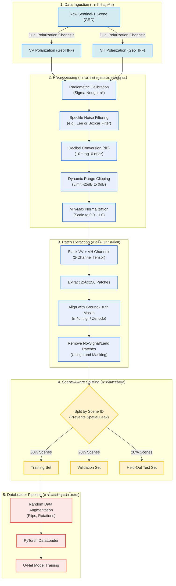

# Project Pelagic: Data Pipeline Workflow
**SWU Prasarnmit — AI Engineering Track (Final Project Checkpoint 1)**

This document details the data pipeline workflow for **Project Pelagic**, outlining how raw Sentinel-1 Synthetic Aperture Radar (SAR) imagery is processed, normalized, patched, and split for binary segmentation model training.

---

## 1. Pipeline Overview (ภาพรวมท่อส่งข้อมูล)

SAR radar data is inherently different from optical photography. It is captured in raw backscatter measurements which are subject to speckle noise, extreme dynamic range, and geometric distortions. The data pipeline translates raw Sentinel-1 GRD (Ground Range Detected) product files into clean, dual-channel `(VV, VH)` tensors ready for U-Net model training.

---

## 2. Preprocessing & Extraction Flowchart (แผนผังขั้นตอนการประมวลผลข้อมูล)

The flowchart below traces each stage from scene download to the training DataLoader.

---

## 3. Detailed Pipeline Stages (รายละเอียดขั้นตอนในท่อส่งข้อมูล)

### 3.1 Radiometric Calibration & Speckle Filtering
* **Calibration**: Radar backscatter measurements (Digital Numbers) must be calibrated to physical backscatter coefficient ($\sigma^0$) to ensure that values are comparable across different satellite passes and dates.
* **Speckle Noise**: SAR images suffer from "salt-and-pepper" noise due to wave interference from multiple scattering elements. Applying a filter like the **Lee Filter** reduces this noise while preserving the sharp boundaries of landmasses and oil slicks.

### 3.2 Clipping & Normalization
* **Decibel Conversion**: Standardizes values on a logarithmic scale ($dB = 10 \cdot \log_{10}(\sigma^0)$) to make weak signal boundaries (such as oil damping) more distinct.
* **Clipping**: Replaces extreme values outside the typical ocean range (clipping values below -25 dB and above 0 dB) to keep model training stable.
* **Normalization**: Scales the values to $[0.0, 1.0]$ to match deep learning input standards.

### 3.3 Spatial Data Leakage Prevention (การป้องกันข้อมูลรั่วไหลทางมิติพื้นที่)
* **Rule**: We **never** split patches from the same Sentinel-1 scene across training and testing sets.
* **Why**: Patches cut from the same large scene share spatial context, atmospheric conditions, and sea states. Splitting patches randomly would cause the model to achieve artificially high validation/test metrics that do not generalize to completely new geographic locations or dates. We split datasets **by Scene ID**.

---

## 4. Thai Terminology Key (ตารางคำศัพท์เทคนิคภาษาไทย)

| English Term | Thai Translation | Description / Context |
| :--- | :--- | :--- |
| **Data Ingestion** | การนำเข้าข้อมูล | กระบวนการดึงข้อมูลดิบจากระบบดาวเทียมเข้าสู่ระบบประมวลผล |
| **Radiometric Calibration** | การปรับเทียบค่าความเข้มสัญญาณวิทยุ | การเปลี่ยนระดับสีเทาดิบเป็นค่าสัมประสิทธิ์การสะท้อนกลับจริง ($\sigma^0$) |
| **Speckle Noise** | สัญญาณรบกวนแบบจุดระยิบระยับ | จุดสีขาวดำที่เกิดจากการสะท้อนของคลื่นเรดาร์ที่กระเจิงบนพื้นผิว |
| **Decibel (dB)** | เดซิเบล | หน่วยลอการิทึมที่แสดงอัตราส่วนของพลังงานสัญญาณสะท้อนกลับ |
| **Min-Max Normalization** | การปรับข้อมูลให้อยู่ในแถบค่าต่ำสุด-สูงสุด | การแปลงช่วงข้อมูลเป็น $[0.0, 1.0]$ เพื่อให้โมเดลประมวลผลได้เสถียร |
| **Spatial Leakage** | การรั่วไหลของข้อมูลทางมิติพื้นที่ | ปัญหาที่โมเดลจดจำสภาพแวดล้อมใกล้เคียงในฉากเดียวกันแทนที่จะเรียนรู้ลักษณะจริง |
| **Held-Out Test Set** | ชุดข้อมูลประเมินผลที่แยกออกไว้ | ชุดข้อมูลที่โมเดลไม่เคยเห็นในตอนฝึกฝนหรือการจูนไฮเปอร์พารามิเตอร์เลย |
| **Data Augmentation** | การเพิ่มพูนข้อมูล | การดัดแปลงรูปภาพ (หมุน, กลับทิศ) เพื่อช่วยให้โมเดลทนทานและไม่ Overfit |
