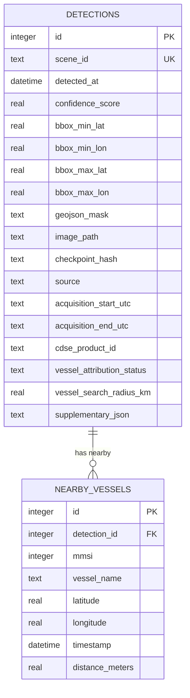

# Project Pelagic: Database Schema Design
**SWU Prasarnmit — AI Engineering Track (Final Project Checkpoint 1)**

This document defines the relational database schema for storing detection metadata and AIS tracking data in **Project Pelagic**.

---

## 1. Database Selection & Strategy (กลยุทธ์และการเลือกฐานข้อมูล)

For the proof-of-concept (PoC) phase, the system uses **SQLite** as its database engine.
* **Why SQLite**: It is a self-contained, serverless, file-based database that requires zero configuration. This ensures that the code can run immediately on any evaluator's or project team member's computer without installing a local PostgreSQL or PostGIS server.
* **Geospatial Storage**: Since SQLite does not have spatial querying out of the box (without complex SpatiaLite extensions), spatial geometries (like the boundary of the detected slick) are stored as **GeoJSON strings** in a `TEXT` field. This string can be read directly by the FastAPI backend and passed to Leaflet.js, which natively renders GeoJSON.

---

## 2. Entity Relationship Diagram (แผนภาพความสัมพันธ์ของเอนทิตี - ERD)



---

## 3. SQL Table Schema (คำสั่งสร้างตาราง SQL)

```sql
-- Table: detections
-- Stores metadata of oil slick detections from processed SAR scenes
CREATE TABLE detections (
    id INTEGER PRIMARY KEY AUTOINCREMENT,
    scene_id TEXT NOT NULL UNIQUE,          -- Sentinel-1 Scene Identifier
    detected_at DATETIME DEFAULT CURRENT_TIMESTAMP, -- Timestamp of model analysis
    confidence_score REAL NOT NULL,         -- Model confidence level (0.0 to 1.0)
    bbox_min_lat REAL NOT NULL,             -- Bounding box Min Latitude
    bbox_min_lon REAL NOT NULL,             -- Bounding box Min Longitude
    bbox_max_lat REAL NOT NULL,             -- Bounding box Max Latitude
    bbox_max_lon REAL NOT NULL,             -- Bounding box Max Longitude
    geojson_mask TEXT NOT NULL,             -- GeoJSON geometry of the detected slick polygon
    image_path TEXT NOT NULL,               -- Local file path to the output overlay mask (.png)
    checkpoint_hash TEXT,                   -- First 12 hex chars of the checkpoint file's MD5.
                                             -- Lets /api/predict tell a genuine cache hit (same
                                             -- scene_id, same checkpoint) apart from a stale row
                                             -- left by a since-swapped checkpoint, and refresh it
                                             -- in place instead of silently returning old results.
    source TEXT NOT NULL DEFAULT 'holdout', -- 'holdout' | 'synthetic' | 'live'. Only 'live'
                                             -- detections (POST /api/live/fetch) have a real
                                             -- acquisition datetime -- see below.
    acquisition_start_utc TEXT,             -- Real Sentinel-1 acquisition start, straight from
    acquisition_end_utc TEXT,               -- CDSE's OData catalog (ContentDate.Start/End) --
                                             -- never fabricated/defaulted. NULL for holdout/
                                             -- synthetic scenes, which have no acquisition
                                             -- timestamp anywhere in the source dataset (see
                                             -- docs/status.md).
    cdse_product_id TEXT,                   -- Real CDSE OData product UUID for 'live' detections.
    vessel_attribution_status TEXT,         -- Why nearby_vessels is populated or empty:
                                             -- 'ok' (real GFW vessels found), 'empty' (GFW
                                             -- queried, zero within radius), 'skipped_no_credentials'
                                             -- (GFW_TOKEN unset), 'skipped_no_timestamp' (no real
                                             -- acquisition_start_utc to query GFW with -- every
                                             -- holdout/synthetic detection), or 'error' (GFW query
                                             -- failed). Lets the frontend show an honest reason
                                             -- instead of a silent "0 vessels" that looks identical
                                             -- to "never checked." Replaces the old hardcoded
                                             -- mock_vessels this project shipped with previously.
    vessel_search_radius_km REAL,           -- Radius used for the GFW query, for 'live' detections.
    supplementary_json TEXT                -- Optional evidence: original SAR metadata/previews,
                                             -- era5 status/components/provenance, temporal comparisons,
                                             -- optical status/date/cloud metadata/RGB preview.
                                             -- NULL for legacy rows. Exposed as supplementary on details.
);

-- Table: nearby_vessels
-- Stores AIS telemetry of vessels located close to the detection at the time of sensing
CREATE TABLE nearby_vessels (
    id INTEGER PRIMARY KEY AUTOINCREMENT,
    detection_id INTEGER NOT NULL,          -- Foreign key linking to detections table
    mmsi INTEGER NOT NULL,                  -- Maritime Mobile Service Identity (unique ship ID)
    vessel_name TEXT,                       -- Name of the ship (if available)
    latitude REAL NOT NULL,                 -- AIS reported latitude
    longitude REAL NOT NULL,                -- AIS reported longitude
    timestamp DATETIME NOT NULL,            -- Time the AIS coordinate was recorded
    distance_meters REAL NOT NULL,          -- Calculated distance from the vessel to the slick center
    FOREIGN KEY (detection_id) REFERENCES detections (id) ON DELETE CASCADE
);

-- Indexing for performance optimization
CREATE INDEX idx_detections_scene ON detections(scene_id);
CREATE INDEX idx_vessels_detection ON nearby_vessels(detection_id);
```

---

## 4. Thai Terminology Key (ตารางคำศัพท์เทคนิคภาษาไทย)

| English Term | Thai Translation | Description / Context |
| :--- | :--- | :--- |
| **Relational Database** | ฐานข้อมูลเชิงสัมพันธ์ | ระบบจัดการฐานข้อมูลที่จัดเก็บในลักษณะตารางที่มีการเชื่อมโยงความสัมพันธ์กัน |
| **Entity Relationship Diagram (ERD)** | แผนภาพความสัมพันธ์ของเอนทิตี | แผนภาพที่ใช้นำเสนอโครงสร้างและตารางต่าง ๆ ในฐานข้อมูลรวมถึงความสัมพันธ์ |
| **Primary Key (PK)** | คีย์หลัก | คอลัมน์ที่ข้อมูลห้ามซ้ำและระบุถึงข้อมูลแต่ละแถวได้อย่างชัดเจน |
| **Foreign Key (FK)** | คีย์นอก | คอลัมน์ที่อ้างอิงไปยังคีย์หลักของอีกตารางเพื่อเชื่อมโยงความสัมพันธ์กัน |
| **MMSI (Maritime Mobile Service Identity)** | หมายเลขระบุตัวตนเรือทางวิทยุคมนาคม | รหัสเฉพาะตัว 9 หลักสำหรับระบุลำเรือพาณิชย์ |
| **GeoJSON** | รูปแบบจัดเก็บพิกัดภูมิศาสตร์แบบเจสัน | รูปแบบมาตรฐานสากลสำหรับจัดเก็บวัตถุทางภูมิศาสตร์ในรูปข้อความ JSON |
| **Bounding Box (bbox)** | กรอบพิกัดสี่เหลี่ยมขอบเขต | พิกัดจุดต่ำสุด-สูงสุด (Lat, Lon) ที่กำหนดขอบเขตรอบคราบบนแผนที่ |
| **Cascading Delete** | การลบข้อมูลที่เกี่ยวเนื่องตามกัน | คำสั่งที่ระบุให้ลบข้อมูลเรือใกล้เคียงออกทันทีเมื่อลบข้อมูลประวัติการตรวจพบ |
