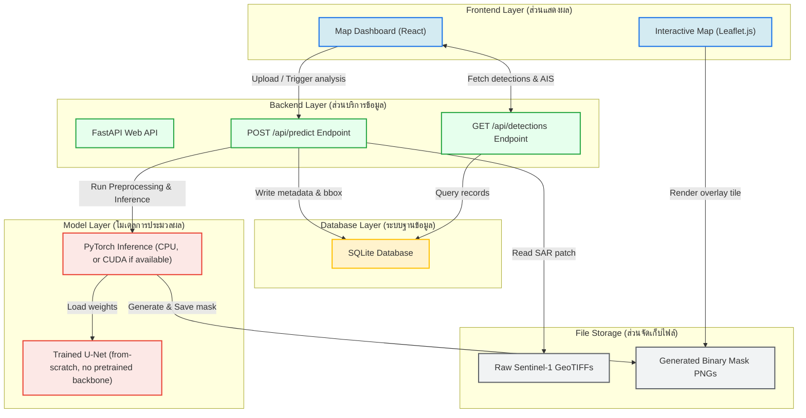

# Project Pelagic: System Architecture Design
**SWU Prasarnmit — AI Engineering Track (Final Project Checkpoint 1)**

This document defines the system architecture for **Project Pelagic**, a proof-of-concept (PoC) system for detecting oil slicks in Sentinel-1 Synthetic Aperture Radar (SAR) imagery. 

---

## 1. Architecture Overview (ภาพรวมสถาปัตยกรรมระบบ)

The system utilizes a lightweight, modular architecture designed for local development and demonstration. It is structured into five distinct layers:
1. **Frontend (ส่วนแสดงผลผู้ใช้งาน)**: A React-based web dashboard using Leaflet.js to display satellite footprints, detection mask overlays, and nearby AIS vessel coordinates.
2. **Backend API (ส่วนบริการข้อมูล)**: A FastAPI service serving REST endpoints for model inference, spatial queries, and mock AIS telemetry.
3. **Database (ระบบฐานข้อมูล)**: An SQLite database storing detection history, geo-coordinates, confidence scores, and surrounding AIS vessel telemetry.
4. **Model Inference Layer (ส่วนประมวลผลโมเดล AI)**: A from-scratch PyTorch U-Net segmentation model (no pretrained backbone), loaded directly via `torch.load` at API startup and run with plain PyTorch inference (CPU, or CUDA if available) — no ONNX export step exists anywhere in this codebase.
5. **Data Storage (ส่วนจัดเก็บข้อมูล)**: Local file storage containing raw Sentinel-1 GeoTIFF scenes and output binary segmentation masks.

---

## 2. System Architecture Diagram (แผนภาพสถาปัตยกรรมระบบ)

The diagram below maps the relationships and data flow between the system components.

---

## 3. Component Details (รายละเอียดส่วนประกอบระบบ)

### 3.1 React + Leaflet.js Frontend
* **Purpose**: Serves as the operator dashboard. It displays the geographical boundaries (footprints) of processed Sentinel-1 scenes and overlays the binary segmentation masks corresponding to detected oil slicks.
* **AIS Overlay**: Pulls coordinates of nearby vessels from the backend to overlay AIS tracks, allowing operators to visually correlate oil slicks with vessels in the vicinity.

### 3.2 FastAPI Backend
* **`POST /api/predict`**: Accepts a local scene ID, reads the matching GeoTIFF, runs preprocessing, tiles the scene into 256x256 patches (matching the training/eval patch regime — see `src/inference.py`), runs U-Net segmentation over each tile, stitches the result, traces contours into a GeoJSON polygon, and logs the detection to SQLite.
* **`POST /api/live/fetch`**: Live satellite pipeline. Accepts bounding box coordinates, queries the Copernicus Data Space Ecosystem (CDSE) OData catalog, fetches calibrated dual-pol SAR via Sentinel Hub Process API, runs tiled inference and OpenStreetMap land masking, and matches real nearby AIS vessels via Global Fishing Watch (GFW). Supports opt-in supplementary evidence:
  * **Multi-Temporal SAR Revisit (`include_temporal`)**: Fetches alternate-date Sentinel-1 acquisitions over the same footprint to check for feature persistence.
  * **Sentinel-2 Optical RGB (`include_optical`)**: Fetches Sentinel-2 L2A true-color imagery with cloud filtering for visual context.
  * **ERA5 Wind Check (`include_era5`)**: Queries CDS for scene-center 10m wind speed vectors (gracefully degrades to `not_configured` when credentials are not supplied).
* **`GET /api/previews/{filename}`**: Serves disk-stored high-resolution preview images (`data/raw/live/previews/`) with filename validation, path traversal prevention, and LRU eviction.
* **`GET /api/detections`**: Queries the SQLite database to fetch historical detections with coordinates, timestamps, and confidence scores for rendering on the map.
* **`GET /api/detections/{id}`**: Fetches one detection's full detail, including its associated nearby AIS vessels and supplementary evidence.
* **`GET /health`**: Reports API and model-load status.
* **Database & Seeding Strategy**: `init_db(seed_demo=False)` ensures startup creates clean tables without injecting mock data. Explicit seeding is provided by `python scripts/seed_demo_data.py`.
* **Continuous Integration**: `.github/workflows/ci.yml` runs automated regression tests on push/PR.

### 3.3 U-Net Inference Engine
* **Plain PyTorch**: Inference runs directly against the trained `.pt` checkpoint via `torch.load` / `model.eval()` — there is no ONNX export step. The model is a from-scratch 4-level U-Net (`DoubleConv` blocks, no pretrained backbone), loaded once at API startup and reused across requests.

### 3.4 SQLite Database
* Stores structured metadata rather than raw spatial polygons to avoid the configuration complexity of PostGIS during early academic presentation. Features, coordinates, and bounding boxes are stored as standardized GeoJSON strings.

---

## 4. Thai Terminology Key (ตารางคำศัพท์เทคนิคภาษาไทย)

| English Term | Thai Translation | Description / Context |
| :--- | :--- | :--- |
| **System Architecture** | สถาปัตยกรรมระบบ | การวางโครงสร้างและองค์ประกอบหลักต่าง ๆ ของระบบ |
| **Proof of Concept (PoC)** | โครงการต้นแบบเพื่อพิสูจน์แนวคิด | ตัวต้นแบบที่มีฟังก์ชันเพียงพอต่อการทดสอบสมมติฐาน |
| **Binary Semantic Segmentation** | การแบ่งส่วนภาพเชิงความหมายแบบสองส่วน | การจัดกลุ่มพิกเซลในภาพออกเป็น 2 กลุ่ม (คราบน้ำมัน vs พื้นหลัง) |
| **Model Inference** | การอนุมานโมเดล / การประมวลผลของโมเดล | การนำโมเดลที่ฝึกสอนเสร็จแล้วมาใช้ประมวลผลข้อมูลใหม่ |
| **Speckle Noise** | สัญญาณรบกวนแบบจุดระยิบระยับ | สัญญาณรบกวนเฉพาะตัวในภาพถ่ายดาวเทียมเรดาร์ (SAR) |
| **AIS Overlay** | การซ้อนทับข้อมูลระบบระบุตัวตนเรือ | การนำจุดพิกัดการเดินเรือ (AIS) มาพล็อตทับลงบนแผนที่ |
| **Bounding Box** | กรอบล้อมรอบวัตถุ | กรอบสี่เหลี่ยมที่กำหนดขอบเขตพื้นที่ที่ตรวจพบคราบน้ำมัน |
| **VV/VH Polarization** | โพลาไรเซชันแบบ VV/VH | ทิศทางการส่งและรับสัญญาณคลื่นเรดาร์ในแนวดิ่งและแนวราบ |
